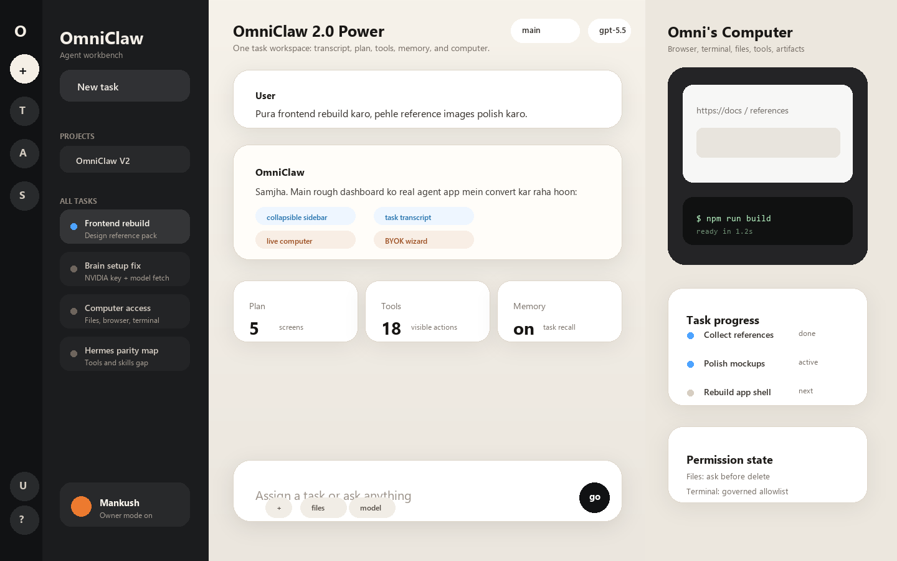
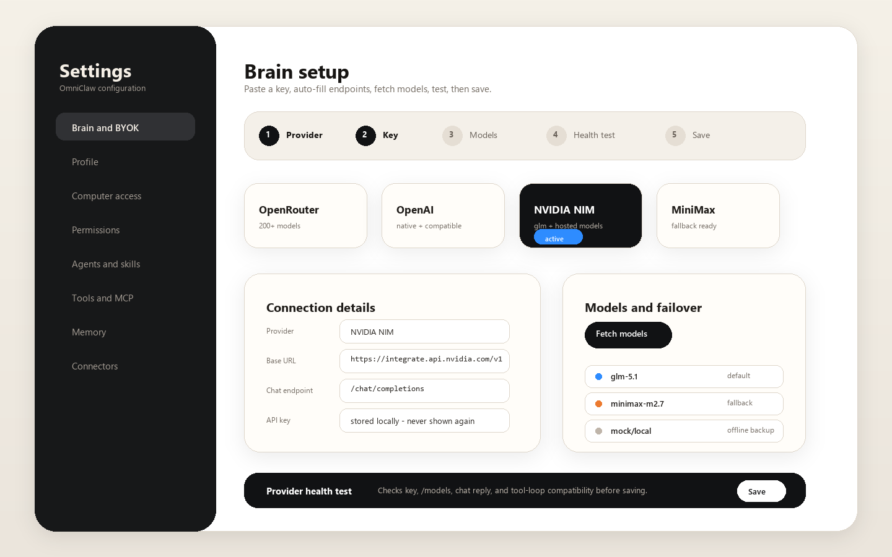
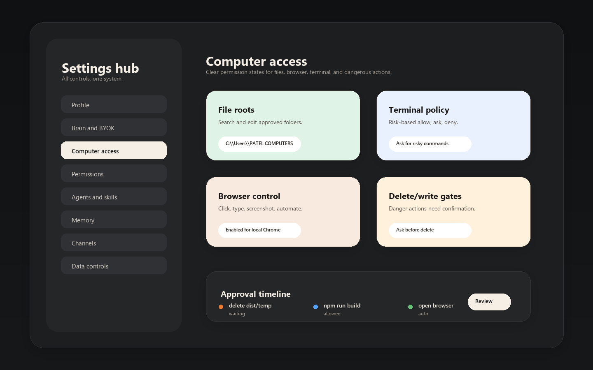
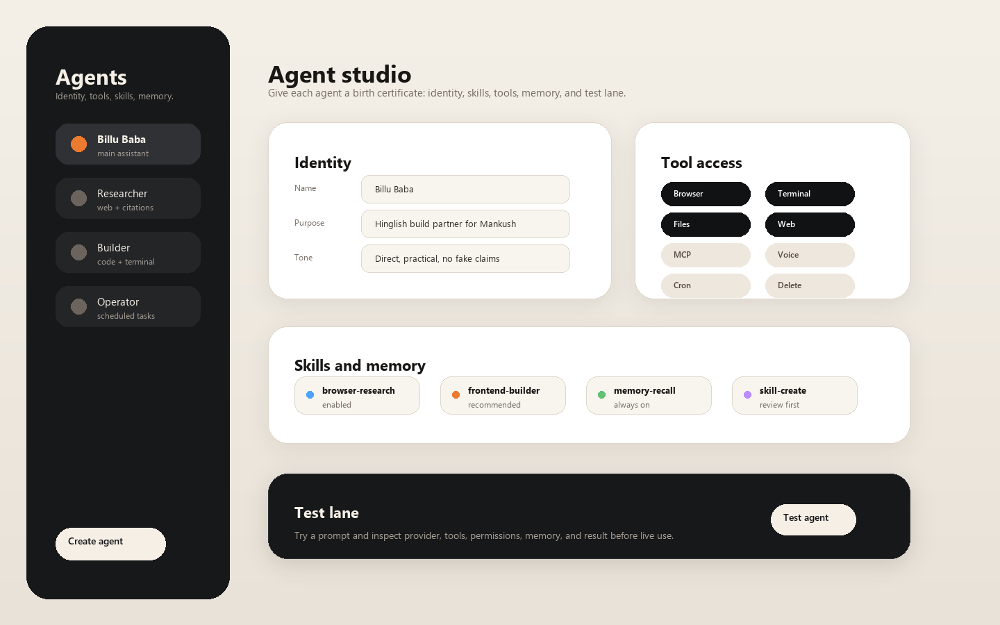
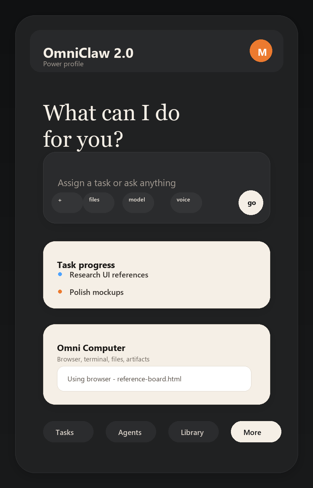

# OmniClaw V2 Frontend Rebuild Reference Pack

This pack is the design gate before rebuilding the OmniClaw frontend. The current problem is not one bad chat screen. The whole product shell needs to feel like an AI agent workbench: tasks, chat, live computer, providers, permissions, agents, skills, memory, and settings must sit inside one coherent interface.

## Reference Sources

Use these for direction, not pixel copying:

- Manus: user-provided screenshots show the strongest target pattern: left task/project rail, center task transcript, right "computer" panel, task progress, mobile drawer, and simple first screen.
- OpenAI Codex: app concepts around settings, in-app browser, computer use, local environments, commands, automations, worktrees, and permissions.
- Cursor: agent/chat composer, background tasks, inline tool progress, model controls, and project context.
- OpenRouter BYOK: provider key priority, fallback, multiple keys, model filters, and provider detail behavior.
- Hermes Agent reference: agent loop, tools, memory, skills, gateway, cron, MCP, terminal backends, and closed learning loop.

Primary source links:

- OpenAI Codex docs: https://developers.openai.com/codex/cloud
- Cursor docs: https://cursor.com/docs
- Manus official site: https://manus.im/
- OpenRouter BYOK docs: https://openrouter.ai/docs/guides/overview/auth/byok
- Local Hermes reference: ../HERMES_AGENT_REFERENCE.md

## Current Frontend Problems

- Chat, session history, live run, and computer status feel split into separate tools instead of one task workspace.
- Sidebar is overloaded and does not behave like a modern collapsible task rail.
- BYOK/model setup is too manual: users expect provider preset, key paste, auto endpoint, fetch models, test, save.
- Settings are scattered. Permissions, computer access, brain setup, channels, memory, agents, and skills need a clear settings hub.
- "Abort" language is unclear. It should say "Stop task" and explain what will happen.
- Feature pages show raw debug data before user-friendly status/actions.
- Mobile layout is not designed as a first-class experience.

## Target Information Architecture

### 1. Global Shell

- Collapsible icon rail: New task, Tasks, Agents, Scheduled, Search, Library, Settings.
- Expanded sidebar: projects, recent tasks, status footer, provider health, account/profile.
- Top bar: current agent/model, computer permission state, search, share/export, theme.
- One route model: task workspace is home; all other screens are drawers or settings pages.

### 2. Task Workspace

- Center column: transcript, thinking/tool events, final answer, artifacts.
- Bottom composer: text, attach, voice, choose agent/model, send.
- Right column: "Omni Computer" with tabs: Browser, Terminal, Files, Tools, Artifacts.
- Progress card: planned steps, active tool, elapsed time, stop task, retry failed step.
- Session history appears as tasks, not hidden JSON sessions.

### 3. Brain/BYOK Setup

Guided wizard:

1. Pick provider preset.
2. Paste API key.
3. Base URL and endpoints auto-fill from preset.
4. Fetch models from `/models`.
5. Choose default model.
6. Run health test.
7. Save profile and optionally set fallback chain.

Required UX:

- Show what is saved and what is not.
- Show connection test result in plain language.
- Support OpenRouter, OpenAI-compatible, NVIDIA NIM, MiniMax, Anthropic, Gemini, local, and Codex CLI.
- Allow multiple provider profiles and failover order.

### 4. Settings Hub

Settings sections:

- Profile and personalization
- Brain and BYOK
- Computer access
- Permissions and approvals
- Agents and skills
- Tools and MCP
- Channels and connectors
- Memory and knowledge
- Data, logs, export, reset

### 5. Agent Studio

- Agent identity: name, tone, purpose, profile file.
- Tool access: browser, terminal, file write/delete, web, memory, connectors.
- Skills: installed, enabled, recommended, create/update.
- Memory: what the agent remembers, session recall, long-term facts.
- Test lane: try a prompt and see tool trace before using live.

### 6. Responsive Rules

- Desktop: 3 columns: sidebar, transcript, computer.
- Laptop: sidebar can collapse, computer becomes resizable drawer.
- Mobile: sidebar drawer, computer/progress card above composer, transcript first.
- No debug-first screens. Every technical panel needs user-facing summary first, raw log second.

## Polished Direction Images

These are polished visual targets for the rebuild. They are not final production CSS, but they define the shape, density, and screen hierarchy OmniClaw should follow.

## Build Phases

1. Design tokens and shell: reset layout, colors, spacing, typography, icon rail, collapsible sidebar.
2. Task workspace: merge chat, session, live run, and computer into one route.
3. Brain setup: rebuild BYOK/model provider UI as a wizard with save/test/fetch states.
4. Settings hub: rebuild settings, permissions, computer access, tools, memory, connectors.
5. Agent studio: rebuild agents, skills, memory, and test lane.
6. Responsive polish: mobile, keyboard focus, empty states, loading states, error states.
7. Verification: screenshots for desktop/tablet/mobile, provider setup smoke test, chat send smoke test.

## Polish Decisions

- Use a calm Manus-like workbench: dark left rail, warm canvas, focused task transcript, and visible computer panel.
- Keep technical controls powerful but friendly: summaries first, raw logs second.
- Treat BYOK as a guided setup wizard instead of a form dump.
- Treat agents as products with identity, skills, tools, memory, and a test lane.
- Keep "computer access" visibly governed: files, browser, terminal, write/delete gates, and approval history.
- Mobile is not a shrinked desktop page; it gets a task-first home, compact progress card, and computer card.

## Non-Negotiables

- OmniClaw must look like a real desktop agent app, not a debug dashboard.
- The first screen must be usable without reading docs.
- Every powerful permission must be visible, understandable, and reversible.
- Provider setup must have an obvious Save button, model picker, model fetch, and test result.
- Task progress must show what the agent is doing, where it is acting, and how to stop it.
- Raw logs stay available, but never as the main user experience.
